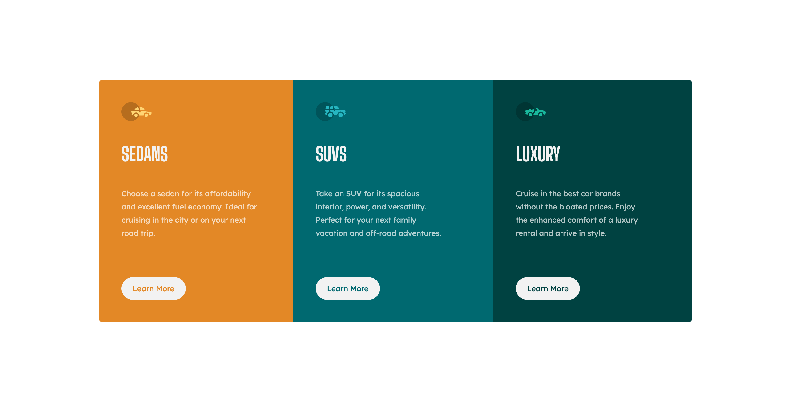

# Frontend Mentor - 3-column preview card component solution

This is a solution to the [3-column preview card component challenge on Frontend Mentor](https://www.frontendmentor.io/challenges/3column-preview-card-component-pH92eAR2-). Frontend Mentor challenges help you improve your coding skills by building realistic projects. 

## Table of contents

- [Frontend Mentor - 3-column preview card component solution](#frontend-mentor---3-column-preview-card-component-solution)
  - [Table of contents](#table-of-contents)
  - [Overview](#overview)
    - [The challenge](#the-challenge)
    - [Screenshot](#screenshot)
    - [Links](#links)
  - [My process](#my-process)
    - [Built with](#built-with)
    - [What I learned](#what-i-learned)
    - [Continued development](#continued-development)
    - [Useful resources](#useful-resources)
  - [Author](#author)

## Overview

### The challenge

Users should be able to:

- View the optimal layout depending on their device's screen size
- See hover states for interactive elements

### Screenshot

### Links

- Solution URL: [GitHub Repository](https://github.com/FrancescoCagnin/fem-challenge-tailwind)
- Live Site URL: [Netlify Website](https://fem-tailwindcss.netlify.app)

## My process

- I got my project folder set up and the tailwind.config.js file up and running.
- I wrote the custom colors and fonts used by the challenge/design in the extend object of the tailwind config file.
- Since it was my very first time using tailwind, I slowly searched in the docs what I needed.
- After making the desktop layout (I know, I should be building mobile first) I wrote the Tailwind necessary to make it work with md and sm breakpoints.
- After a LOT of annoying problems when trying to host the website on Netlify (First time deploying a website with more than a single .css and .html file), I finally deployed it.

### Built with

- TailwindCSS
- Flexbox

### What I learned

This was my first time using TailwindCSS and it has proven to be my favorite tool to style websites!
I also learned how to host more complex projects on Netlify, my hosting platform of choice.

### Continued development

I'll try to use TailwindCSS with JS Frameworks like React once I learn them since it's not fun having messy HTML files with super long classes (and because it would still be a better option)

### Useful resources

- [The TailwindCSS Docs](https://tailwindcss.com/docs/installation) - You don't need Youtube tutorials about Tailwind, here is covered everything I learned and more (of course, it's the official docs)

## Author

- Frontend Mentor - [@FrancescoCagnin](https://www.frontendmentor.io/profile/FrancescoCagnin)
